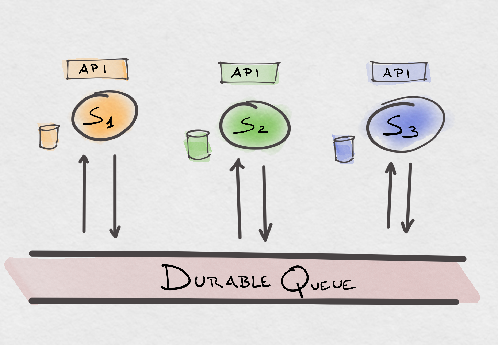
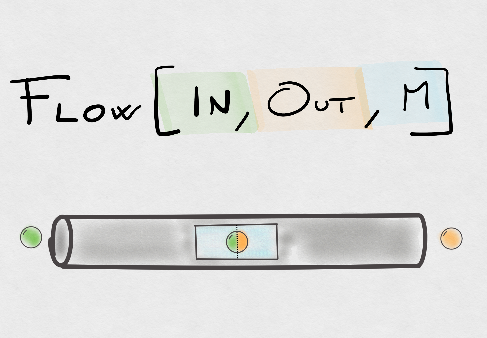
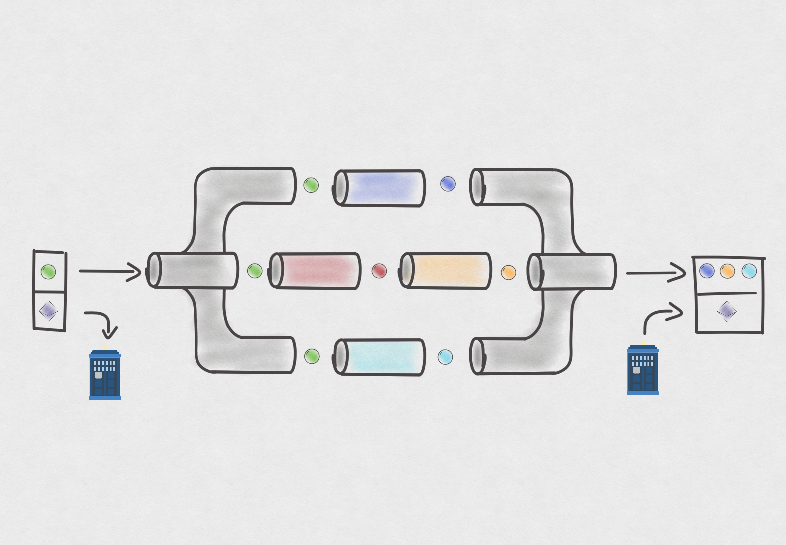

# Speck Flavored Streaming Micro-Services with Akka

---
<!-- _class: invert -->
#### Who the heck are you?
-  
- Andrea Zito
- @nivox
- Senior Software Engineer @ thinkin.io
- [https://nivox.github.io](https://nivox.github.io)


---
<!-- header: Introduction -->

#### What is a Streaming Micro-Service?

* reads data from a streaming source
* performs some computation
* expose API to interact with it
* possibly generates some output...
* ...read by other streaming micro-services

---
#### Desired properties

1. Resilient (recover failures)
1. Scalable (adapt to the data amount)
1. Complete

---
#### Completeness

* Process all the data...
* ... but not more than once

---

#### Exactly once semantic

* Exactly once is a lie 🍰
* At least once
* Idempotency / input de-duplication
* Effectively once

---
#### Typical architecture 


- Durable message queue (Kafka)
- Storage layer
- API layer

---
<!--header: Scenario -->

#### Use case scenario

* Centralised people counter system
* Each entrance has a dedicated sensor
* Edge service collect sensor's data and push to cloud
* Multiple deployment

```json
{ 
    "timestamp": 1640995200000, 
    "deploymentId": "Carnegie Hall", 
    "entranceId": 0, 
    "counter": 1
}
```

---
<!--header: Scenario -->

#### Use case scenario

- Centralised people counter system
- Each entrance has a dedicated sensor
- Edge service collect sensor's data and push to cloud
- Multiple deployment

```json
{ 
    "timestamp": 1640995200000, 
    "deploymentId": "Carnegie Hall", 
    "entranceId": 0, 
    "counter": 1
}
```

---
<!-- header: Implementation: Plain Akka Streams -->

# Akka Streams

* enables creation of (complex) computation pipelines
* providing out of the box back-pressure

---
<!-- header: Implementation: Plain Akka Streams -->

# Akka Streams



---
<!-- header: Implementation: Plain Akka Streams -->

# Let's get coding

#### Plain Akka Streams


---
<!-- header: Implementation: Plain Akka Streams -->

# Considerations

* Interacting (properly) with a flow is not easy...
* ... almost impossible when using dynamic partitioning
* Built-in partitioning does not guarantee at-least-once semantics
* Common tasks often require a lot of non trivial code
* No out of the box support for state persistence

---
<!-- header: Implementation: Plain Akka Streams -->

### Can we do better?


---
<!-- header: Implementation: Spekka Context -->

# Spekka Context

* Provides one-to-one context propagation...
* ... while supporting advanced partitioning

---
<!-- header: Implementation: Spekka Context -->

# Spekka Context



---
<!-- header: Implementation: Spekka Context -->

# Let's get coding

#### Spekka Context

---
<!-- header: Implementation: Spekka Context -->

# Considerations

* Interacting (properly) with a flow is still hard...
* ... but now supported even when partitioning
* Stream order is guaranteed
* Still no support for state persistence

---
<!-- header: Implementation: Spekka Context -->

#### Can we do better?

---
<!-- header: Implementation: Spekka Stateful -->

# Spekka Stateful

* Separates the business logic concerns...
* ... from the management of the state
* providing first class flow interaction

---
<!-- header: Implementation: Spekka Stateful -->

# Let's get coding

#### Spekka Stateful

---
<!-- header: Implementation: Spekka Stateful -->

# Considerations

* Interaction with stream state is now first class
* Side-effects are now first class
* State is still not persisted 🤦

---
<!-- header: Implementation: Spekka Stateful -->

#### Can we do better?

---
<!-- header: Implementation: Spekka Stateful Akka Persistence -->

# Spekka Stateful Akka Persistence

* Spekka Stateful Backend based on Akka Persistence
* Allows to persist state to:
    * Event based: cassandra, sql, ...
    * Durable state: sql, ...

---
<!-- header: Implementation: Spekka Stateful Akka Persistence -->

# Let's get coding

#### Spekka Stateful Akka Persistence

---
<!-- header: Implementation: Spekka Stateful Akka Persistence -->

# Considerations

* Changing storage layer has never been so 🥱
* Still not scalable

#### Can we do better?

---
<!-- header: Implementation: Spekka Stateful Sharding -->

# Spekka Stateful Sharding

* Extends stateful flows *sharding* them on a cluster
* Based on Akka Cluster Sharding

---
<!-- header: Implementation: Spekka Stateful Sharding -->

# Let's get coding

#### Spekka Stateful Sharding

---
<!-- header: Implementation: Spekka Stateful Sharding -->

# Considerations

* Well that was anticlimactic!
* A couple of lines of code...
* Some additional configuration
* And our microservice is now clustered! 🤯

#### Can we do better?

---
<!-- header: Not today... what about the future? -->


---
<!-- header: "" -->
# Conclusion

Spekka help you building:

* effectively once
* stateful
* sharded

---
# Conclusion

Spekka helps you building:

- effectively once
- stateful
- sharded

### Streaming Micro-Services

---
##### Spekka micro-site: 
[https://spekka.github.io](https://spekka.github.io)

## Sponsors
Developement of this library has been sponsored by


---

### Feedback time

- was the problem clear?
- was the solution understandable by non Hakkers?
- was the live-coding vs presentation balance good?
- were you bored?